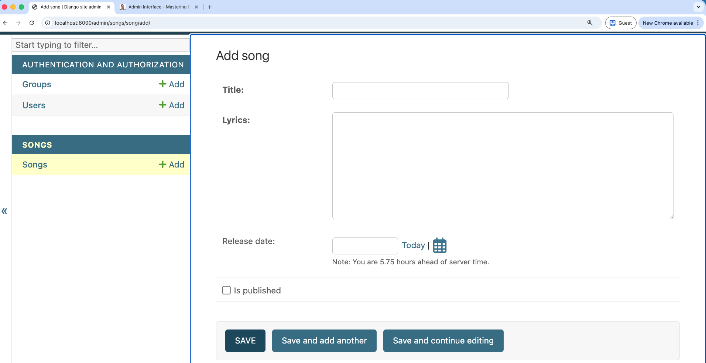

# Admin Interface - Introduction

* **One of Batteries Included** features of Django

* The Django admin interface is a powerful, built-in feature of the Django web framework that provides a ready-to-use administrative interface for managing your application's data.

* It reads metadata from your models to automatically create a quick, model-centric interface where trusted users can manage content on your site.

* It allows you to manage data, view records, and perform CRUD (Create, Read, Update, Delete) operations on your models without needing to write any additional code for basic data management tasks.

## ✅ What Django Admin Is Used For

* Add, edit, delete database records
* Search and filter data
* Manage users & permissions
* Import/export data with plugins
* Quick internal tools for staff teams
* Debugging and development

## 🔧 How It Works

 1. Define models  `models.py`
 2. Register models in `admin.py` - `admin.site.register(<YourModel>)`
 3. Django automatically builds forms, lists, filters, validation, and UI

## ⚙️ Activating the Admin Interface

The Django admin interface is usually enabled by default in a new project, as the `django.contrib.admin` application is included in the `INSTALLED_APPS` setting of your project's settings.py file.

**Requirements:**

- `django.contrib.admin` and its dependencies (like auth, contenttypes, and sessions) must be in `INSTALLED_APPS`.

- The admin's URL configuration must be hooked into your project's main urls.py file (typically path('admin/', admin.site.urls)).
  
- Access: To use it, you must first create a superuser account using the command `python manage.py createsuperuser`. After starting the development server (`python manage.py runserver`), you can access the interface, by default, at `/admin/` (e.g., <http://127.0.0.1:8000/admin/>).


Here is the first screen you will see after logging in:


When you register the models from your apps, they will appear here as well. Below is an example of the admin interface after registering a **Songs** app(with interface to add songs):



## 🎨 Customizing the Admin Interface

* Make it more user-friendly for your admin users(who are often non-technical)
* Tailor it to your application's specific needs

Customization is primarily done by defining a `ModelAdmin` class for each registered model in your app's admin.py file.

```python
from django.contrib import admin
from .models import Song
class SongAdmin(admin.ModelAdmin):
    fields = ('lyrics', 'title', 'release_date') # Ordered list of fields in the add/edit form
    list_display = ('title', 'lyrics', 'release_date') # Columns shown in the list view
    search_fields = ('title', 'lyrics') # Fields to search against
    list_filter = ('release_date',) # Right sidebar filters
    ordering = ('-release_date',)

admin.site.register(Song, SongAdmin)
```

You can customize various aspects of the admin interface using different `ModelAdmin` [options](https://docs.djangoproject.com/en/6.0/ref/contrib/admin/#modeladmin-options). Here are some common customization areas:

| Customization Area | Key ModelAdmin Options | Purpose |
|--------------------|-----------------------|---------|
| List View          | list_display          | Controls which fields or methods are shown as columns in the list of objects. |
| List View          | list_filter           | Adds a right-hand sidebar to filter the list of objects based on field values. |
| Change Form        | fields or fieldsets   | Controls the order and grouping of fields in the add/edit form. |
| Change Form        | inlines               | Allows editing related (foreign key) objects on the same page as the parent object. |
| Actions            | actions               | Defines custom bulk actions that can be performed on selected objects from the list view. |
| Read Only Fields             | readonly_fields         | Specifies which fields should be read-only in the admin interface. |

## 🎨 Customizing the Admin Interface’s Look and Feel

You can modify the visual appearance of the admin interface in several ways:

### Basic Configuration
  
  You can change the main titles and headers by setting attributes on the default AdminSite object (usually in your project's urls.py), such as `admin.site.site_header`, `admin.site.site_title`, and `admin.site.index_title`.
  
### Template Overriding
  
  You can override the default admin templates (e.g., `base_site.html`, `index.html`) by placing your own versions in an admin subdirectory within your project's templates directory.
  
* This is used for custom branding, navigation, or structure.

### Third-Party Themes
  
  A popular way to radically change the look and feel is to use third-party packages, such as **Django Jazzmin** or **Django Unfold**, which are "drop-in" replacements providing modern, responsive UIs, often based on frameworks like Bootstrap or Tailwind CSS.

## 🏠 Customizing the Admin Index Page

The Admin Index Page is the main dashboard you see after logging in.

### Default View
  
  It lists all registered models, grouped by the application they belong to.

### Customization
  
  You can customize this page by overriding the default `admin/index.html` template. You can add custom widgets, links, or a dashboard view to provide relevant information or quick access to management tools. Advanced customization often involves creating a custom AdminSite class and overriding its index() method.

* Overriding the Template
The main index page uses the template located at `django/contrib/admin/templates/admin/index.html`

You can create your own custom dashboard by doing the following:

* Create a folder structure in your app: `geetshala/templates/admin/`.

* Add a custom `index.html` inside that folder. Django will automatically find and use this template instead of the default.

In your custom index.html, you can iterate through the available apps and models (passed to the template via the app_list context variable) and structure the page as needed.

## 🔎 Search

The search functionality is a key feature that allows administrators to quickly find specific records.

  Enabling Search: You enable search for a model by setting the search_fields attribute on its ModelAdmin class.

  It is a tuple of field names (e.g., `search_fields = ('name', 'description')`).

Django will automatically add a search box to the Changelist view and filter the results based on the text entered against the values in the specified fields.

You can search on fields from related models using the double underscore notation (`'foreign_key__related_field'`).

??? tip "Mini Challenge: Customize the Admin Interface"
    - Customize the admin interface for a model in your project by creating a ModelAdmin class. Try adding at least three of the following customizations:
      - Change the order of fields in the add/edit form using the `fields` attribute.
      - Add search functionality using the `search_fields` attribute.
      - Add filters to the list view using the `list_filter` attribute.
      - Customize the columns displayed in the list view using the `list_display` attribute.
