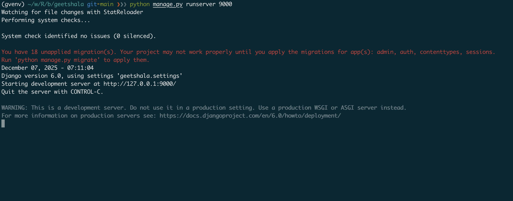

# Making Changes to a Database Schema

## Migration: Working Like a Magician

## Understanding Migrations

Migrations are Django's way of propagating changes you make to your models (adding a field, deleting a model, etc.) into your database schema.

- They are designed to be mostly automatic, but you'll need to know when to create and apply them.

### Creating Migrations

- Command: `python manage.py makemigrations <app_name>`

- Action: This command does not touch the database. It writes a new Python file in the migrations/ directory detailing the schema changes.

### Applying Migrations

- Command: `python manage.py migrate <app_name>`
- Action: This command applies the migrations to the database, creating or modifying tables as specified in the migration files.

### Migration Files

- Content: Each migration file contains a Migration class that defines the operations to be performed on the database schema.
- Unchanging Nature: Once created, migration files should not be modified. Instead, create new migrations for further changes.

### Rolling Back Migrations

- Command: `python manage.py migrate <app_name> <last_good_migration_name>`
- Action: This command rolls back the database schema to the state defined by the specified migration.

### Managing Migrations

- Command: `python manage.py showmigrations <app_name>`
- Action: This command lists all migrations for the specified app, indicating which ones have been applied
