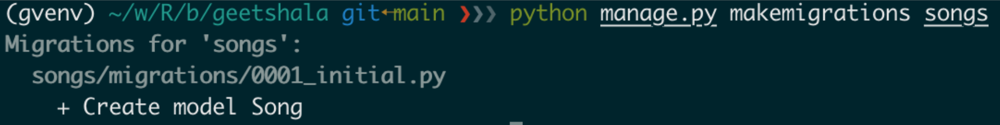

# Topics Covered

- Model
- Administration Site
- Form Processing

## Learning Objectives

- Understand the Model-Template-View (MTV) architecture of Django.
- Learn how to define and manage models in Django.
- Gain proficiency in using Django's admin interface for database management.
- Develop skills to create and process forms in Django applications.

## The MTV Development Pattern

### Understanding Model in Django

---

- the single, definitive source of information about your data.
- contains the essential fields and behaviors of the data you’re storing

- Each model - Python class that subclasses `django.db.models.Model`
- Each attribute - a database field
- Automatically-generated database-access API

#### Defining a Model in Python - Quick Example

```python
  from django.db import models

  class Song(models.Model):
      title = models.CharField(max_length=100) # field of the model and maps to a database column
      lyrics = models.TextField()
      release_date = models.DateField(null=True, blank=True)
      is_published = models.BooleanField(default=False)
```

##### First Model - Database Representation

- Dabase Table - _songs_song_

!!! info "Table Structure"
    | Column Name | Data Type | Description |
    |----------------|--------------|---------------------------------|
    | id | Integer | Auto-incrementing primary key |
    | title | Varchar(100) | Title of the song |
    | lyrics | Text | Lyrics of the song |
    | release_date | Date | Release date of the song |
    | is_published | Boolean | Publication status of the song |

- Table name convention - `appname_modelname`
- In this case, the app name is `songs` and the model name is `Song`, resulting in the table name `songs_song`
- An `id` field is automatically added as the primary key if not explicitly defined.

#### Installing the Model

Process of having Django create the necessary database tables based on the defined models.

##### Creating Migrations

- creating migration class files that describe the changes to be made to the database schema.

```bash
  python manage.py makemigrations
```



##### Applying Migrations

- applying the migrations to the database, creating or modifying tables as specified in the migration files.
- needs to be run whenever there are new migrations to apply.
- requires database connectivity.

```bash
  python manage.py migrate
```

---

### Let's Get Started - Setting Up the Database

---

### [Setting up the MySQL Database server and Creating a Database](database-setup.md)

### Database Settings for Django

- Update the `DATABASES` setting in your Django project's `settings.py` file to configure the connection to your MySQL database.

```python
DATABASES = {
    'default': {
        'ENGINE': 'django.db.backends.mysql',
        'NAME': '<database-name>',
        'USER': '<djangouser>',
        'PASSWORD': '<djangopassword>',
        'HOST': 'localhost',
        'PORT': '3306',
    }
}
```

??? tip "Industry Practice"
    Risk of sharing the database credentials in the codebase. In real-world applications, it's a common practice to use environment variables or configuration management tools to securely manage sensitive information like database credentials. This approach helps prevent accidental exposure of credentials in version control systems and enhances overall security.

!!! question "Mini-Challenge: Introduce Environment Variables for Database Settings"

### Running App Migrations

Command to run migrations for a specific app:
`python manage.py migrate <app-name>`

To run migrations for the `songs` app, use the following command:

```bash
python manage.py migrate songs
```

### Adding Model String Representations

- Standard python method `__str__` to define a human-readable, official string representation of the object.
- In the context of Django models, the `__str__` method is used to provide a meaningful string representation of model instances.

To add a string representation to the `Song` model, you can define the `__str__` method within the model class. This method should return a human-readable string that represents the object.


```python
from django.db import models
class Song(models.Model):
    title = models.CharField(max_length=100)
    lyrics = models.TextField()
    release_date = models.DateField(null=True, blank=True)
    is_published = models.BooleanField(default=False)

    def __str__(self):
        return self.title
```

Significance(why it's important):

- Improves readability in the Django admin interface and other places where model instances are displayed.
- `<Song: Song object (1)>` becomes `<Song: Phoolko Aankhama Phoolai Sansar>`

### Data Access

#### 👨‍💼 The Django Manager: Database Gatekeeper

- The Manager is a Django class that acts as a bridge between your models and the database
- Important component of Django's Object-Relational Mapping (ORM) system
- Every Django model has at least one Manager, named `objects` by default
- The Manager is the interface through which database query operations are provided to Django models
- The Manager can be used to retrieve, filter, and manipulate data in the database
- The Manager's methods generally return a QuerySets, which is a collection of database records, or a single model instance
- Custom Managers can be defined to add extra manager methods or modify the initial QuerySet

### Interacting with the Database Using Django Shell

- Django shell is an interactive Python shell that allows you to interact with your Django project's models and database directly.
- It automatically loads the Django environment, making it easy to work with your models and interact with the database using the Object-Relational Mapper (ORM) system, which translates Python code into database queries.

This is a powerful tool for:

- Inspecting and debugging data.

- Testing ORM queries and custom model methods.

- Performing one-off administrative tasks and data clean-up.

To start the Django shell, use the following command in your terminal:

```bash
  python manage.py shell
```

#### 🛠️ Basic Database Operations (CRUD)

#### Inserting

- Inserting new records into the database using Django ORM.
- Two common methods

##### Creating an instance and saving it

```python
    new_song = Song(title="फूलको आँखामा फूलै संन्सार", lyrics="फूलको आँखामा फूलै संन्सार, काडा को आँखामा काडैं संन्सार । झुल्किन्छ है छायाँ बस्तु अनुसार, काडाको आँखामा काडैं संन्सार । चित्त सुद्ध होस् मेरो बोलि बुद्ध होस्, मेरो पैतलाले किरै नमरोस् । राम्रो आँखामा खुल्छ राम्रै संन्सार, काडाको आँखामा काडैं संन्सार । तह-तह जुन देखु कालो रातैमा, जीवन संगीत सुनु म सुख पातैमा । सङ्लो मनमा खुल्छ है सङ्लै संन्सार, काडाको आँखामा काडैं संन्सार ।", release_date="2004-10-11", is_published=True)
    new_song.save()
```

##### Create method

```python
  new_song = Song.objects.create(title="Song Title", lyrics="Song Lyrics", release_date="2023-10-01", is_published=True)
```

#### Selecting Objects

Selecting involves retrieving data from the database using the Manager (.objects) and returning it as a QuerySet (a list-like collection) or a single object.

##### Retrieving All Objects

```python
all_songs = Song.objects.all()
for song in all_songs:
    print(song.title)
```

##### Filtering Objects

```python
published_songs = Song.objects.filter(is_published=True)
for song in published_songs:
    print(song.title)
```

##### Get a Single Object

```python
song = Song.objects.get(id=1)
print(song.title)
```

##### Ordering Results

```python
ordered_songs = Song.objects.order_by('release_date')
for song in ordered_songs:
    print(song.title)
```

#### Updating Data

Updating data involves retrieving an existing object, modifying its attributes, and saving the changes back to the database.

##### Instance Update

```python
song = Song.objects.get(id=1)
song.title = "Updated Song Title"
song.is_published = False
song.save()
```

##### QuerySet Update

```python
Song.objects.filter(is_published=True).update(is_published=False)
```

!!! note "Note"
    The `update()` method directly modifies the database and does not call the `save()` method on individual instances, so any custom save logic will not be executed.

#### Deleting Objects

Deleting involves removing one or more records from the database.

##### Instance Deletion

```python
song = Song.objects.get(id=1)
song.delete()
```

##### QuerySet Deletion

```python
Song.objects.filter(is_published=False).delete()
```

## The Dumb Way to Do Database Queries in Views

1. Query in Template

```html

    <p>{{ song.lyrics }}</p>
    <h2>{{ song.album.song_count }}</h2>

```

2. Query Inside Template Logic

```html
  
    Song exists
  
```

### Why this is dumb?

- Tempaltes should NOT contain business logic

    Only presentation. Not data fetching or filtering.

- Hard to test

    You can’t easily test performance or logic buried in templates.

- Causes N+1 Query Problem

    The biggest source of performance issues.

- Violates Django’s MTV Architecture

    Breaks the separation of concerns between Models, Views, and Templates.

### 🌟 The Smart Way: Do All Queries in the View, Not in the Template

- Query in the View only. No queries in the template.

```python
from django.shortcuts import render
from .models import Song
def song_list(request):
    songs = Song.objects.all().select_related('album')
    return render(request, 'songs/song_list.html', {'songs': songs})
```

- Simple Template! Fast. Clean. Proper MTV.

```html

    <p>{{ song.lyrics }}</p>
    <h2>{{ song.album.song_count }}</h2>

```
